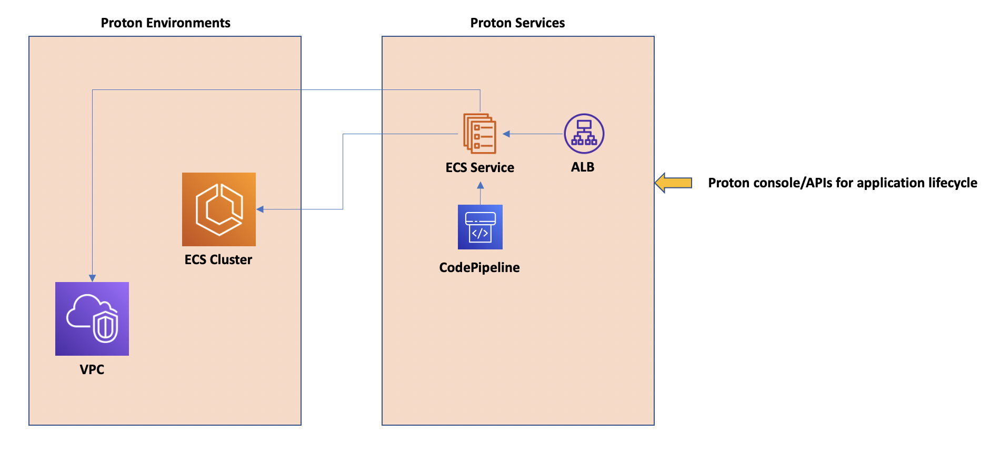

### Introduction to AWS Proton

#### What is Proton?
[Proton](https://aws.amazon.com/proton/) is a fully managed AWS service that helps engineering platform teams build developer portals to streamline the SDLC (software development lifecycle). Proton has two main goals: increase developers' productivity and agility while allowing organizations to maintain the right level of control and governance. 

#### Who are the Proton customers? 
Proton has two main actors:
- the platform admin: responsible for authoring application templates and everything in the DevOps spectrum that aims at removing undifferentiated heavy lifting for the developer
- the developer: responsible for writing application code and deploying it using the platform abstractions and artifacts made available by the platform admin
> These two actors are mapped to two AWS managed IAM policies: `AWSProtonFullAccess` and `AWSProtonDeveloperAccess` (there is also a `AWSProtonReadOnlyAccess`).

#### Why would you use Proton?  
There are two set of reasons why customers find Proton useful. They are grouped by user profiles. Usually the larger the organization is, the greater the value they can extract from the product.  

Platform admins use Proton because they can: 
- create standard and versioned templates to better support their developers 
- provide embedded best practices as part of such templates with "sane parameter defaults" for novice users 
- create guard-rails in the SDLC that guarantee governance and compliance 
- have a consolidated view of the stacks deployed and their version's across AWS accounts
- and more... 

Developers use Proton because they can:
- deploy their application in a self-service manner
- deploy their applications without being experts in AWS services
- avoid reinventing the wheel and allowing the re-use of best practices (for security, availability, cost optimization) codified by the platform teams in the templates 
- and more... 

#### Is Proton a service catalog product? 
While Proton could act as a generic multi-purpose service catalog, Proton really shines in the context of application delivery because it's SDLC-aware (for lack of a better description). 

Proton works with 3 mains objects: 

- `Environments`: they represent shared infrastructure components that multiple services can potentially consume. Environments (templates) are defined by platform admins and are (typically) deployed by the platform admins. Think of VPCs, clusters, databases and so forth. 
- `Services`: they represent application infrastructure components that embed the best practices developers can leverage. Services (templates) are defined by platform admins and are deployed by the developers. Think of Fargate services, Lambdas and so forth. 
- `Pipelines`: they represent, well ... pipelines. Similarly to services, pipeline (templates) are defined by platform admins and are deployed by the developers along with the service. Pipelines are an optional object and the developer is allowed to "bring their own" pipeline if they so wish. 

While the `environments` resemble the outputs of a generic service catalog (because you can pretty much package any stack in an environment), `services` and `templates` are very application specific constructs. For example, a required parameter for a service is a code repository and if you don't supply one you can't deploy a service. 

These objects are tied and aware of each others. For example, the pipelines (when included) are tied to specific services. Also, the service templates are declared compatible with specific environment templates so that when a developer deploys a specific service, Proton allows the deployment only to environments that are compatible with that service.   

This is a simplistic visual representation of these objects: 

#### What type of IaC can Proton use? 
Proton, as of February 2022, can use both CloudFormation and Terraform. Additional languages, such as CDK (Cloud Development Kit), planned to be supported. 

CloudFormation supports Jinja as an out-of-the-box customization engine in Proton. This provides a great deal of flexibility including parameters substitution as well as rendering of CloudFormation code as an output of more sophisticated "for loops". Please also note that the Proton workflow may vary (even substantially) depending on the IaC language you choose to use. In general, CFN provides a more "managed" experience than Terraform. 

Discussing this level of details is beyond the scope of this short introduction to Proton. Please refer to the [documentation](https://docs.aws.amazon.com/proton/latest/adminguide/ag-template-bundles.html) for more information about Proton.    

### A typical real life use case for Proton

Sometimes people find hard to relate to Proton and how it applies to real world problems. Some of them may think "can you not just use `xyz` instead of Proton?" (where `xyz` could be standard CloudFormation, Copilot or other products). Thinking about when and why to use Proton is as important as explaining how Proton works. So before we move into the "how" (the tutorial), it could be useful to think about a fictitious (yet very common) real life situation where Proton can help (and where `xyz` alone couldn't cut it).  

---- 
Pizza&Ananas is a high quality restaurant chain that has decided to double down on investments for their on-line presence. They have a lot of initiatives to build multiple applications to improve their customers’ on-line experience, including a new food delivery service and more. 

To meet this goal, they are hiring a new team of developers. They also want to take this opportunity to bring more structure to the current development team(s) and introduce standards re how their applications are being developed and deployed. Right now the developer team is small and there is really no governance or anything. When it comes to the undifferentiated heavy lifting of *getting the deployments right*, all the devs are reinventing the wheel thus wasting a lot of their time. To be fair, there are a couple of developers with previous DevOps experience that kind of act as advisors for the other developers. This is more tribal knowledge than anything structured. Obviously, this is not a model that can scale well, also considering the new people joining with mix of experiences. 

The CIO at Pizza&Ananas, Beth, decided to invest into a small team (2 people) to set these standards and work on the undifferentiated heavy lifting of building everything that is needed to raise the bar on automation, efficiency, security, availability and all the non-functional requirements that developers have had to deal with so far. Beth is also particularly concerned about security exposures (there have been a couple of cases where their devs were very close to opening S3 buckets publicly by mistake). Pizza&Ananas realizes that the amount of work that is needed in that space is enormous but on the other hand, their budget does not allow to build a larger team to tackle this problem. At the end of the day... their business is preparing great pizzas and not building developer portals. 

A few weeks later, Pizza&Ananas assembled the platform team. One of the original developers, Anna, that was *infrastructure savvy* transitioned into this team. She was one of the roaming devs dispensing suggestions on how to deploy on AWS and now this is her full time job. In addition to bringing excellent tech skills for the role, she also brings a great deal of history re “how things work at Outback”. Beth also hired John from one of Pizza&Ananas' biggest competitors. He has a great deal of experience building internal platforms and will partner with Anna to build one for Pizza&Ananas. 

Anna and John start to brainstorm and craft some high level tenets for the platform they want to build. These tenets look like the following: 

* they want to build at least three environments (test, staging and production) each in a separate AWS account 
    * They may need more over time (developer sandboxes? QA accounts? who knows.... but for now they have only identified these three)
* these environments need to be as close as possible in the way they are configured (err they need to be identical, that’s the whole point). For this they need to automate the preparation of these environments as much as possible 
* the platform team function (Anna and John) will set the standards for VPC deployments with strict rules on the layout (public/private subnets, NAT GW configurations, etc.) and they will be responsible for the provisioning and the maintenance of the shared environments. 
* These environments will evolve over time, they are not a one-shot. For example, they know that, down the road, they may be adding additional security controls (e.g. VPC flow logs) and additional operational features (e.g. enabling Client VPN connectivity)     
* this is not yet critical, and they don’t know if they will get to this point ever, but Anna and John want to make sure that the platform is flexible enough to partition developers and their applications in their own separate accounts if need be. In this case a developer will only be entitled to deploy to a specific environment they have been entitled to (the entitlement is still TBD, but it’s probably going to be based on AD team/group membership)  

Now that the platform team has set some core tenets for the infrastructure, they start to set some guard-rails for how the developer experience looks like. Anna and John are well aware that finding a good compromise between flexibility and maintaining control is key to the success of the platform. Make it too loose and Beth will complain Pizza&Ananas lost control. Make it too strict and the developer team will complain that they can’t do their job and that they do not want to use the platform. Gregg, one of the most senior developers at Pizza&Ananas, has already expressed a lot of concerns about this. 

Anna and John start to craft some high level tenets for the specific developer user experience of the platform they are  building. These tenets look like the following: 

* The platform will initially support three major application "patterns/templates":  
    * stateless public facing web services 
    * stateless private facing web services
    * stateless private function (Lambda)  
* The platform will initially support three major data services "patterns/templates":  
    * Postgres database 
    * DynamoDB table 
    * S3 bucket 
* For these application and data services, the platform team function may require in the future to change some characteristics of these deployments. For example, the platform team may mandate that all S3 buckets need to be encrypted or that the Postgres database high availability configuration need to be changed
    * ideally all these changes should be, as much as possible, implemented on-line, on existing resources or on future deployments AND done in a way that is fully transparent to the developer (albeit the dev may be in control of when the change is being made) 
* The platform team will need to have a way to allow certain developers (or teams) to have access to some services templates but not others. For example team A can deploy all data services but team B can only deploy DynamoDB tables (again this segmentation will need to be based on AD team/group membership)
* Except for the function and data services (which are all product-specific), the public and private web services products leveraged to build the template should be considered an implementation detail for the developer. In other words the platform team may decide to implement them with different products (e.g. ECS/Fargate vs. App Runner) without the developer even knowing
* Ideally all services being deployed should be discoverable by name. For example, if a developer deploys a private micro-service with a particular name, another micro-service should be able to reference it by its name without having to do anything special. Alternatively, the services should be exposing/advertising their endpoints so that those can be imported into other services via an environment variable
* Similarly, data services should be advertising their endpoints (Postgres endpoint, S3 bucket ARN or DDB table ARN) so that it can be imported into the micro-services applications when/if needed
* Pizza&Ananas initially will not dictate or manage where the code needs to be hosted. The only requirement is that GitHub and GitLab will be supported SCM tools
* Developers will be allowed to write their code in any language they want with a caveat: if the code is written in Python, Node, Ruby or Java, the platform will be capable of running it (within the available templates) without anything else required. If the code is written in any other language the developer will be required to author a Dockerfile that the platform will use to support the deployment of the code
* The platform team will provide deployment pipelines for all the templates. For the devs this means that once they have deployed their application templates, they will only need to update the code in the source repository. The platform will take care of transitioning the code through the various environments (test, staging, production)
* The transition from the various stages is initially gated by a manual approval from the developer. Down the road more automation will be implemented to move to production in a more hands-off way
* Using these pipelines will be mandatory, at least initially. The platform team is not discounting having to create exceptions and letting developers use their own CI/CD workflows and tooling of choice, but there is going to be a big push for standardization to achieve better control, better security and ultimately letting developers focus more on delivering value through new functionalities and features
* Ultimately, the platform team will investigate how and when to allow developers to modify the certified templates (either by letting them modify the templates themselves or by allowing developers to augment them with additional infrastructure). This is not a priority for now but Anna and John know there will be asks from developers with specific needs 

After setting the core deployment experience, Anna and John start to think about how the ownership model for the deployments should work. Should the platform function own the operations of these applications? Should the developers own it? They know there is no right answer to this question, and they have seen various organizations implementing very different models. After going through some considerations they opted to use a model where the developers own the deployments (not just their lifecycle but also the monitoring and their operations). These are some reasons why they picked this model: 

* they (Anna and John) are a small team, and they need to offload as much work as possible (to survive)
* the developers know best how their application works and know what to monitor, check and what the metrics are actually telling. In other words there are good reasons behind the “you build it, you own it” motto  

These are some operational tenets Anna and John came up with: 

* developers will have direct access to CloudWatch for their own services and will have full access to performance and operational metrics, as well as all the logs for their respective micro-services and data services  
* they will be able to set alarms on specific metrics and be alerted on those 

---- 

This fictitious situation goes beyond what the tutorial in this repository will walk you through. It is only intended to outline a very common scenario where customers are benefiting from adopting Proton to create the platform experience described above. 

### Enough for talking - lets' get to the action 

You are ready to start the tutorial. Move to [this page](./vpc-ecscluster-lb-fargate-tutorial/chapter1/README.md) and enjoy the ride.
