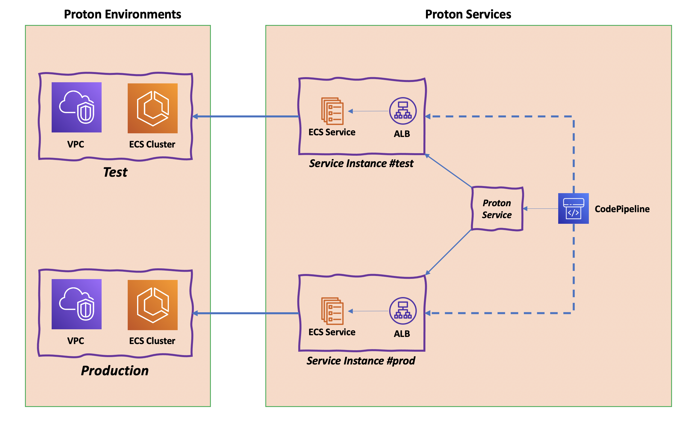
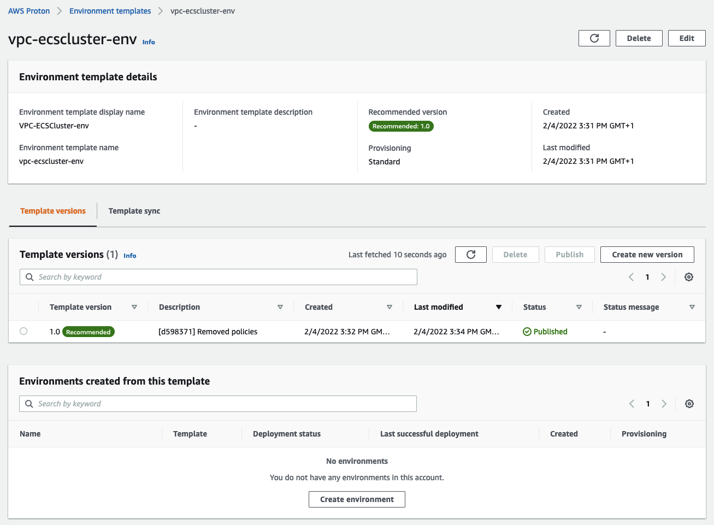
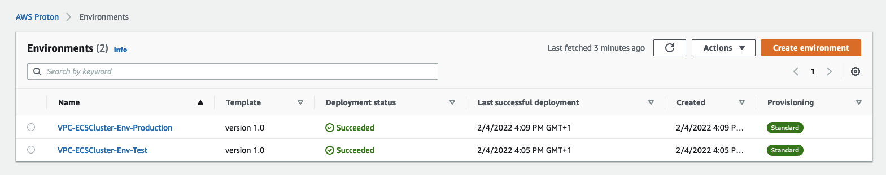
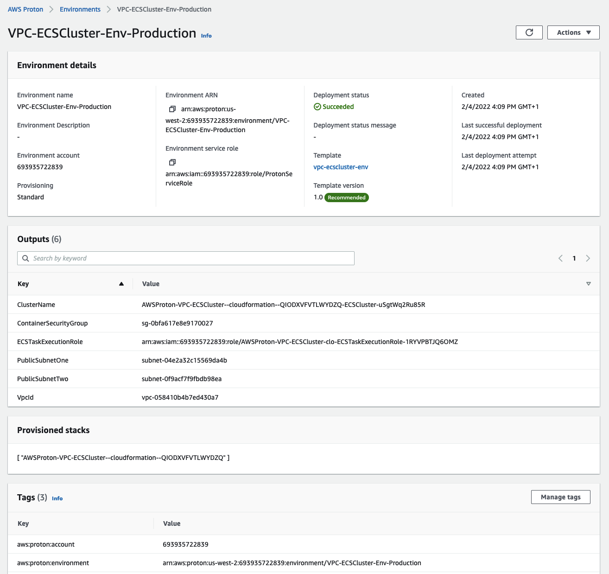
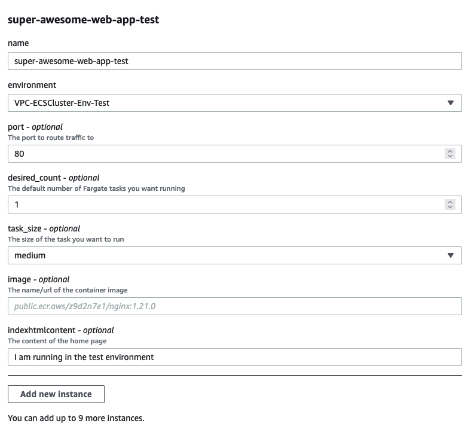
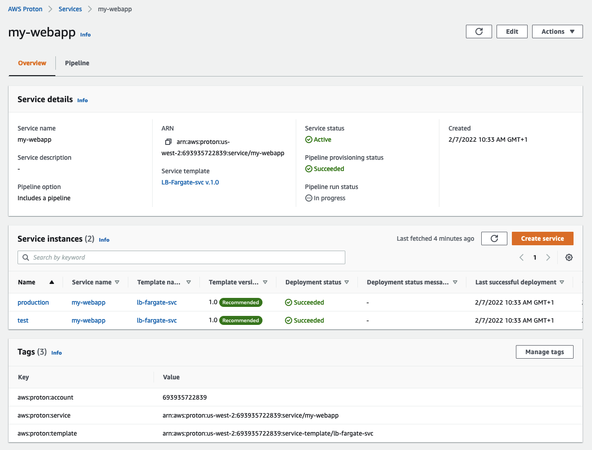
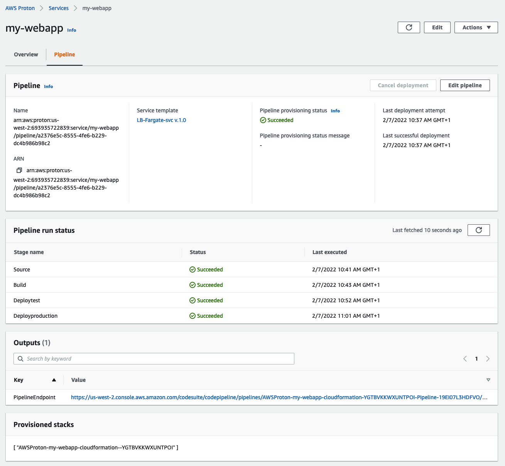
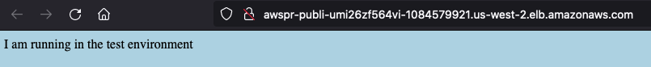
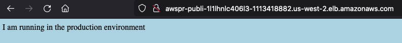

### Deploying a generic container-based application using Proton 

This repository includes a tutorial that will guide users interested in Proton to appreciate the end-to-end workflows to deploy a working Proton service. As alluded in the introduction, there are many options available in Proton. In addition to, obviously, an infinite spectrum of use cases and templates that you can author, there are options in the IaC you can use, how you upload your templates to Proton, how you render and deploy those templates, whether or not you want an embedded and managed application deployment pipeline and possibly more. A tutorial cannot cover all the possible combinations so we will take an opinionated approach to demonstrate these end-to-end workflows. 

These are some of the decisions (and opinions) we took in the tutorial: 

- we will be using CloudFormation as the IaC of choice for this exercise 
- we will import the templates using the Git Sync method (as opposed to using the S3 upload mechanism)
- we will deploy a service with an embedded pipeline
- we will use a simple container-based application to focus on the Dev/Ops and CI/CD workflows in Proton
- we will mostly use the console in this tutorial (needless to say everything can be done )

> Also note that we need to strike a balance: the tutorial needs to be as simple as possible (so not to spend too much time on it) but, at the same time, sophisticated enough to demonstrate a typical Proton workflow. Do not expect the "time-to-wow" of Amazon Proton to be any close to the "time-to-wow" of [AWS App Runner](https://aws.amazon.com/apprunner/). They are two different services, with two different goals and objectives. 

This is what we are going to implement in this tutorial: 

#### Prerequisites and housekeeping

The usual suspects. At a minimum: an AWS account, a working IDE environment with the AWS CLI, a GitHub account and a git tool of your choice.

You will need to fork this repository in your git account to start with. 

In addition, please fork [this simple container-based application](https://github.com/mreferre/nginx-custom-site). This will be the application code we will deploy with Proton. The peculiarity of this “application” is that it can be configured with a system variable to drive particular behaviors. Specifically, when the `INDEX_HTML_CONTENT` variable is passed to the container a custom web page with the content of the variable is shown with a specific hard-coded background. Please refer to the short README (https://github.com/mreferre/nginx-custom-site) file for more information. We will use the `INDEX_HTML_CONTENT` variable to simulate an application that uses different end-points in different environments (e.g. a test database or the production database). And we will use the hard-coded background to similute an application code change (with subsequent push to git and rebuild of the image). 

Last but not least, before we switch to the Proton console, you need to setup an AWS CodeStar connection following [these instructions](https://docs.aws.amazon.com/proton/latest/adminguide/setting-up-for-service.html#setting-up-vcontrol). This will allow you to access your GitHub account (and your repos) from Proton.

In an effort to simplify the tutorial, we are going to use an IAM administrative user/role to impersonate both a platform team admin as well as a developer. As a stretch goal, if you want, you may want to create two separate users with two separate AWS managed IAM policies (`AWSProtonFullAccess` and `AWSProtonDeveloperAccess`). In a production environment this would obviously be a best practice. 

#### Creating the templates [ PLATFORM ADMIN ]

This repository includes both the `environment` and the `service` templates (respectively in the [vpc-ecscluster-env](./vpc-ecscluster-env) folder and in the [lb-fargate-svc](./lb-fargate-svc) folder). You can have a look at the structure there and learn more about the layout in the [Template bundles](https://docs.aws.amazon.com/proton/latest/adminguide/ag-template-bundles.html) section of the Proton documentation. 

Go to the Proton console and switch to the `Settings/Repositories" page. Add the repository in your account that represents the fork of this repo. 

Now switch to the `Templates/Environment templates` page and click `Create environment template`. In the `Template bundle source` select `Sync templates from Git`. Pick your fork, set the Branch name to `main`. 

In the `Template details` set `vpc-ecscluster-env` as the `Template name`. 

> It is important that you set the name exactly because Proton will scan the repo for that exact folder name (and version structure). 

Set a `Template display name` for convenience, leave everything else as default and click `Create environment template`. 

Within a few seconds you should see a template version `1.0` appear. It's in `Draft` state. Click `Publish` and it will move into `Published` state. 

You should see something like this: 

Now switch `Templates/Service templates` making sure to use `lb-fargate-svc` in the name of the template. Again, the name must match exactly. 

The other thing you need to do here is to declare (in the `Compatible environment templates` section) which environment templates are compatible with this service template. Select the environment template you created above. 

Before you click `Create service template` note the `Pipeline` option is flagged. That's the default and Proton expects to find the pipeline IaC files in this repository in the service template folder. You can optionally choose to have an external pipeline but we want to use the one that ships with our repository. Create the template and publish it like you did with the environment template. 

Congratulations, you have registered both your environment and service templates as a platform admin. 

#### Deploying the enviroments [ PLATFORM ADMIN ]

As a platform admin, you are going to deploy two environments. On the main console, go to `Environments` and click `Create environment`.  Select the environment template you created above and click `Configure`. 

Leave all the default and select an `Environment name` (this time you can pick what you want - we suggest you pick `VPC-ECSCluster-Env-Test`). In the `Environment roles` section let Proton create a new service role for you (unless you already have one). This is the role that Proton will use to provision all the resources defined in your environment template. 

> Note that since Proton cannot know what you intend to deploy, this role will have an `Administrative` IAM policy associated. In a real deployment you probably want to downgrade that policy to only include the permissions this role requires. Click `Next`.

This is where the Jinja magic starts to happen. You are asked to customize the parameters that the template allows you to customize. We can accept the defaults and click `Next` (unless you really feel you don't like those values). At the summary page click `Create`. 

The `deployment status` will be `in progress` for a little while and then will report `Succeeded`. 

Go through the `Create environment` workflow once more and configure a new environment called `VPC-ECSCluster-Env-Production`. This time you can pick the previously created IAM service role. 

At the end of these two workflows you should see your environments ready: 

Congratulations, you have created your `test` and `production` environments as a platform admin.

Click on one of them to explore the details: 

Please note at the bottom both the `Tags` that are used to track your deployments. However the most interesting thing here are the `Outputs`. This template crates a VPC and an ECS cluster so it outputs things like the cluster name, the VPC id, the subnets id, etc. If you deploy a database in the environment you'd output its endpoint. These outputs are defined in the CloudFormation template and can be referenced by the Proton services that will be bound to this environment using the Jinja syntax. If you explore the CloudFormation template for the Proton service you will see a lot of references to these outputs.     

To recap, as an admin, you created both the environment and the service templates. Then you deployed two environments (test and production). You have prepared  the ground for a developer to start their workflows. Your job as a platform admin is done (for now).

#### Configuring the CI/CD pipeline role [ PLATFORM ADMIN ]

xxx 

#### Deploying the service [ DEVELOPER ]

If you have used specific IAM users/roles it is now a good time to switch to the developer role/user. As a developer you want to focus on building code and you may or may not know much about AWS. 

Go to the Proton console and move to the `Services` page. Click `Create service` and you should see the template that the admin has created *for you*. It should be called something along the lines of `LB-Fargate-svc` (or the display name you picked above). Click `Configure`. Give your service a name. I am going to call it `my-webapp`. 

In the `Service repository settings` you should select the fork of the application we specified in the prerequisite section. Now you are going to select how many instances of this application you want to deploy. We want two because we want to deploy one in the test environment and one in the production environment. 

Fill the first instance with these parameters: 

On the same page click on `Add new instance` and fill the second instance with similar parameters. Change only the following parameters: 
- the `name` of the second instance should be `production`
- the `environment` should be set to the production environment
- its `indexhtmlcontent` variable should be `I am running in the production environment` 

Leave everything else at the defaults, click `Next` and at the summary page click `Create`.

| Please avoid using long names for the service and service instances because they are chained in the CFN template and there is a size limit. 

This will take a few minutes to create the test and prod infrastructure (Proton service instances) that represent the load balanced Fargate service along with the pipeline that checks for changes on the application repository (the nginx custom application). 

| Important note on IAM roles: note that the developer does not need to specify an IAM role to assume for deploying the resources as part of the wizard. Proton will use the IAM roles the administrator has specified when deploying the environments these service instances bind to.   

This is how the `Overview` tab of your service should look like: 

And this is how the `Pipeline` tab of your service should look like: 

Note how the developer has a feedback right inside the Proton console about the various pipeline stages with a link to the pipeline itself in the `Outputs` should they need further details. 

If you explore the endpoints of each service instance you will see that ther content has been customized according to the settings of the `indexhtmlcontent` variable.

This is the `test` endpoint: 

This is the `production` endpoint:

Congratulations, you have deployed your first Proton service! 

> In this tutorial you have created two service instances but you could have created three or more. Have you wondered how a supposedly static CFN pipeline IaC is able to adapt to a random number of service instances? This is where the power of Jinja comes in. If you explore the pipeline infrastructure IaC code in the repository you will note a `for` loop that iterates through all the instances configured in Proton and will render a pipeline that includes all service deployments! 

