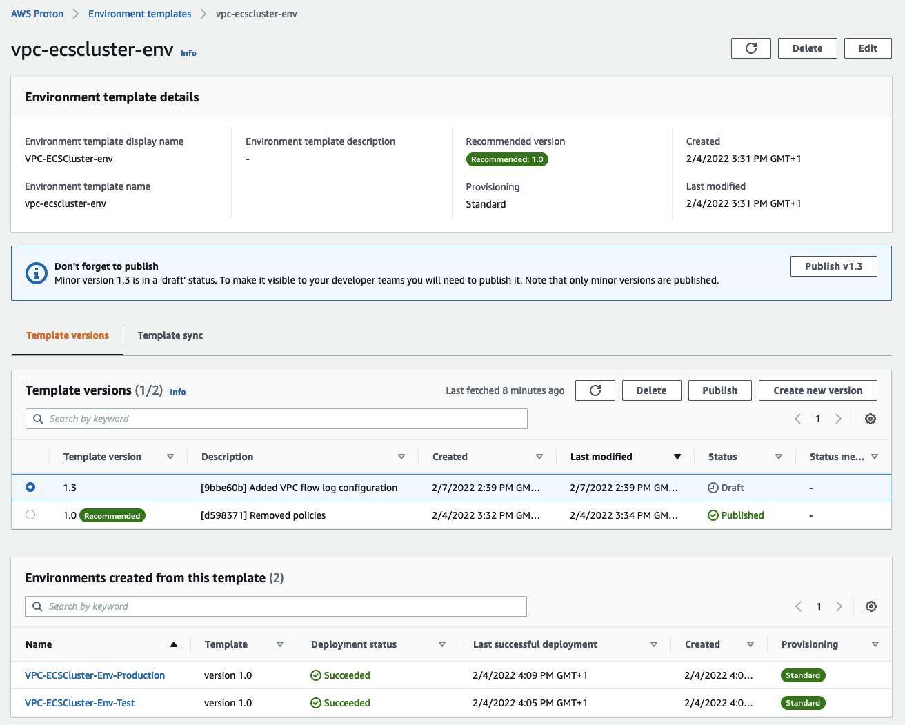
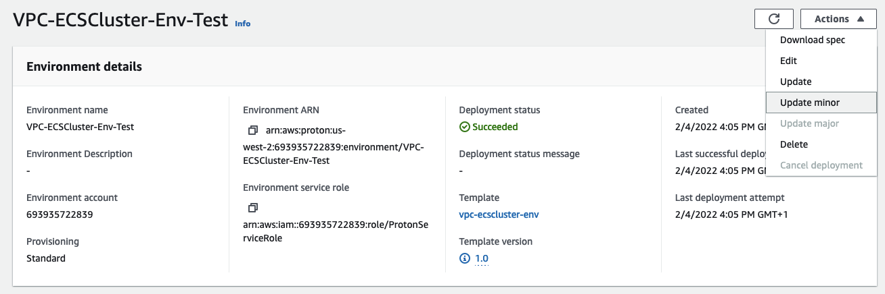
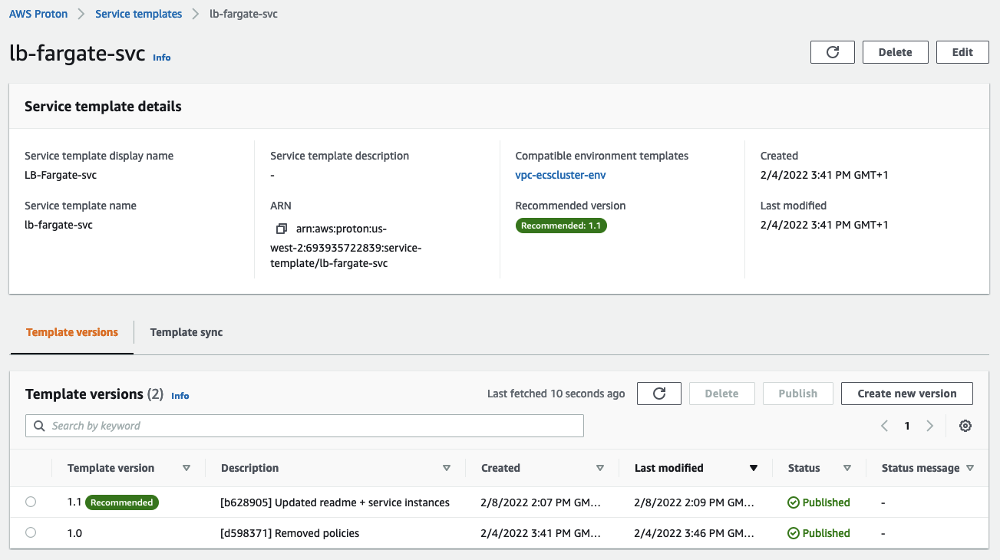
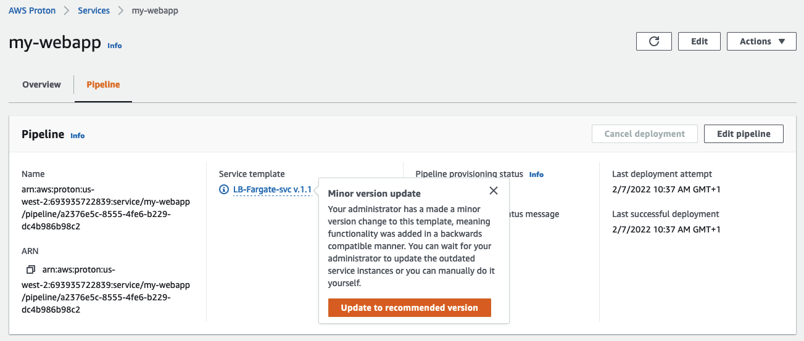
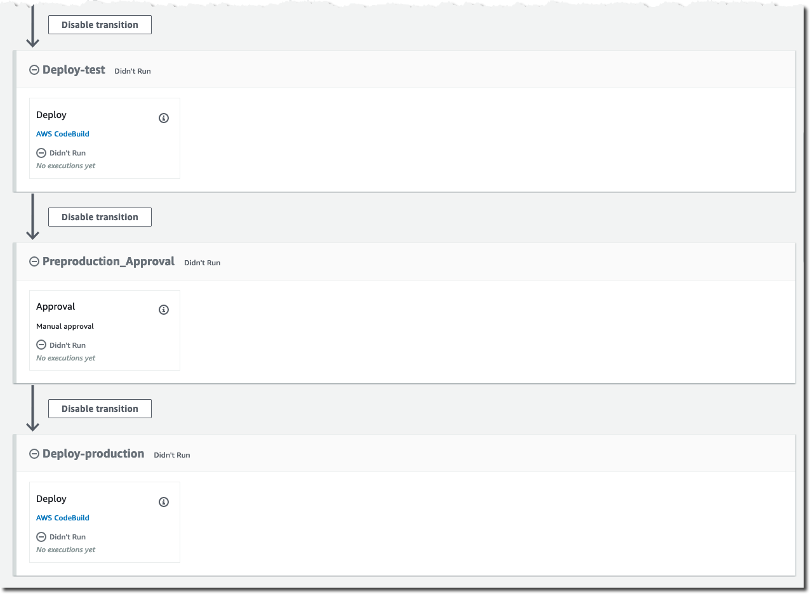
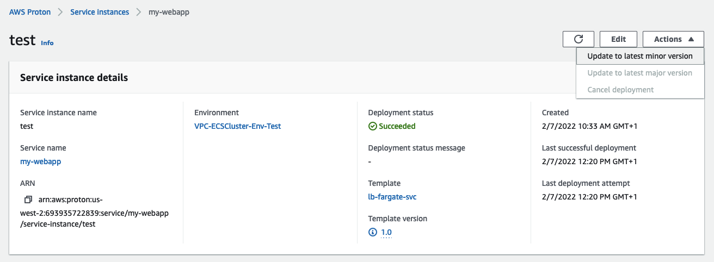

### Maintaining templates and deployments in Proton  

In the previous chapter we discovered how a Proton admin could import templates and how Proton admin and developers can deploy environments and services. This is table stake for Proton but not where Proton shines. You start appreciating the value of Proton when you start considering how admins can maintain the deployments for day2 operations. This is what we will explore in this chapter. 

> Important: a certain level of familiarity with editing CloudFormation templates and pushing them to GitHub is required for this chapter. 

### Updating the environment template [ PLATFORM ADMIN ]

Let's imagine that the platform administrator team has a new compliance requirement for VPC deployments that necessitates enabling `VPC flow logs`. This was not enabled in the original environment templates. 

To do this, we need to modify the CloudFormation template (in GitHub) that defines the environment infrastructure. Open the `cloudformation.yaml` file in the `vpc-ecscluster-env` folder and add the following YAML code right after the VPC and subnets definition: 

```
  VPCFlowLog:
    Type: AWS::EC2::FlowLog
    Properties:
      DeliverLogsPermissionArn: !GetAtt FlowLogRole.Arn
      LogGroupName: !Ref FlowLogsGroup
      ResourceId: !Ref VPC
      ResourceType: VPC
      TrafficType: ALL
  FlowLogRole:
    Type: AWS::IAM::Role
    Properties:
      AssumeRolePolicyDocument:
        Statement:
        - Effect: Allow
          Principal:
            Service: [vpc-flow-logs.amazonaws.com]
          Action: ['sts:AssumeRole']
      Path: /
      ManagedPolicyArns:
        - 'arn:aws:iam::aws:policy/CloudWatchLogsFullAccess'
  FlowLogsGroup: 
    Type: AWS::Logs::LogGroup
    Properties: 
      RetentionInDays: 7
```

Make sure you push this change to GitHub.

This will create a CloudWatch LogGroup and will configure the VPC to use it as its flow log destination. Because this is not a breaking change to the VPC configuration we will update the template in the `v1` folder (this will result in a so called `minor version` change). Please read [this documentation page](https://docs.aws.amazon.com/proton/latest/adminguide/ag-template-versions.html) for a better understanding of minor and major versions. Commit the change to the repository. 

Because we have imported the template using `Git Sync`, Proton will discover the new commit and the change in the template and will propose it as a `Draft`: 



> Note that each commit that modifies the template will automatically increase the minor version by one. In this case I made a few commits but I deleted the first two minor versions so Proton presents me version `1.3`. If this is your first commit you should see version `1.1` 

Go ahead and `Publish` the draft. Your `recommended` version should become `1.1` (mine is 1.3 for the reason above).

Note in the same environment template page you can see all environments (and their version) that have been originated from this template. This provides a good mechanism to track your deployments. 

### Updating the environments [ PLATFORM ADMIN ]

If you return to your `test` environment you will notice that under `Template version` it says `1.0` with a small information icon. If you expand that it will say that `you are not using the latest minor version.` 

You can then go ahead and `Update minor` (without changing anything in the wizard): 



At the end of this process the `Template version` should report the latest minor version and it should have a `recommended` green next to it (to remind the user that it's the latest available). If you are curious, in the EC2 console you can explore the two VPC and note that one (the `test` VPC) has the `Flow log` configuration filled properly while the other does not. 

You  Congratulations, you have just updated your first Proton environment by adding VPC flow log support. Go ahead and update the `production VPC as well`. 

### Updating the service template [ PLATFORM ADMIN ]

Now that we have updated both the environment template and the environments themselves, let's explore updating the services. Here is a situation that you, as a platform admin, may come across: 

Business is requesting that all production deployments are gated by a manual approval to prevent changed from accidentally flowing to production (this requires a change in the service pipeline). We still want to automatically deploy changes in our test stage though, so we need to use Proton's template rendering engine to create different behaviors based on the environment.

First locate the `pipeline_infrastructure` CloudFormation template, navigate to the section where the pipeline `Actions` are declared for each service instance, and add the `Preproduction_Approval` action below. This new action needs to be added after the start of the loop (``) and before the action named `'Deploy-{{service_instance.name}}'`. There's a `TODO` comment in the pipeline CFN template to help you locate the right place to make this change.

```

        - Actions:
            - ActionTypeId:
                Category: Approval
                Owner: AWS
                Provider: Manual
                Version: '1'
              InputArtifacts: []
              Name: Approval
              RunOrder: 1
          Name: Preproduction_Approval

``` 
> This action needs to be added after the start of the loop (``) and before the action named `'Deploy-{{service_instance.name}}'`.

There is quite a bit of Jinja magic going on here. Here is what's happening. You just placed an action inside a `for` loop (``) that basically create a `Deploy` action per each service instance you created. What you added above is a piece of code that, basically, says "if the environment is called `production` then add a pipeline action that is a manual approval. The developer knows that when they create an instance in an environment called `production` Proton will add a manual approval gate. 

By referencing the environment name, the platform team is able to enforce best practices for service teams.

You are also getting complaints from developers that they find it hard to debug their applications when they are running in the test environments (your policies do not allow you to enable exec'ing into containers in production but you can enable that for anything that is not production environments). 

We can again use Proton's template rendering engine to enable [ECS exec](https://docs.aws.amazon.com/AmazonECS/latest/developerguide/ecs-exec.html) for the test environment while leaving it disabled for production. 

Locate the `instance_infrastructure` CloudFormation template and add the following snippet somewhere in the `Resources` section: 

```
  ECSTaskRole:
      Type: AWS::IAM::Role
      Properties:
          AssumeRolePolicyDocument:
              Statement:
              - Effect: Allow
                Principal:
                   Service: [ecs-tasks.amazonaws.com]
                Action: ['sts:AssumeRole']
          Path: /
          Policies:
              - PolicyName: SSMMessagesPolicy
                PolicyDocument:
                  Statement:
                      - Effect: Allow
                        Action:
                          - 'ssmmessages:CreateControlChannel'
                          - 'ssmmessages:CreateDataChannel'
                          - 'ssmmessages:OpenControlChannel'
                          - 'ssmmessages:OpenDataChannel'
                        Resource: '*'
```

Locate the line that says `TaskRoleArn: !Ref "AWS::NoValue"` and change it to `TaskRoleArn: !Ref 'ECSTaskRole'`

Last but not least add the `EnableExecuteCommand: true` in the `Service` resource properties. It should look something like this when added (note how we are using Jinja to only add the required parameter for the deployments in the `VPC-ECSCluster-Env-Test` environment):  

```
  Service:
    Type: AWS::ECS::Service
    DependsOn: LoadBalancerRule
    Properties:
       
      EnableExecuteCommand: true 
       
      ServiceName: '{{service.name}}_{{service_instance.name}}'
```

Now that you modified the service instance and pipeline properties, you can push the changes to GitHub. Proton should detect a new minor version that you can publish. That will become the new `recommended` version: 



> The 1.1 minor version was an intermediate change that was made before this. If you followed the tutorial you should have your useful minor version with the changes above at `1.1`.   

The work of the platform admin team is done here! 

### Updating the service [ DEVELOPER ]

Now you are back as a developer. As you explore the service that you deployed, you notice something. Proton hints you that the administrator has made available a new (minor) version of the service template. You know this is going to introduce new operational improvements so you are eager to update your service to use the latest template. 

> note you can't update the service as a whole to the new minor template. You need to individually update each instance and the pipeline. 

We will start with the pipeline. Move to the `Pipeline` tab of your service, click the informational warning on your template and click `Update to recommended version`: 



Within a few minutes the pipeline should be updated. If you explore its layout you will note that now there is indeed a manual approval right before the deployment of the `production` instance:



Now you can update each of the service instances. Open the `test` instance detail page, click `Actions` and then `Update to latest minor version`: 



Keep all the values and update it. 

Go through the same process for the `production` instance. 

If you want to check that the ability to exec into a container has only been activated for the test deployment and not for the production instance you can try to exec into both the ecs tasks and see what happens. You can explore the ECS console to gather the cluster names and task ids. Once you have them you can run the following tests. 

Trying to exec into the task that belongs to the `test` instance:

```
$ aws ecs execute-command --region us-west-2 --cluster AWSProton-VPC-ECSCluster--cloudformation--ELCIZOMUBTAUNFR-ECSCluster-wkWkMoVgxQfH --task 209fac6ff22b44ee81d3fc0a4adcf375 --command bash --interactive

The Session Manager plugin was installed successfully. Use the AWS CLI to start a session.


Starting session with SessionId: ecs-execute-command-0f138402d3067db5a

root@ip-10-0-0-53:/# ls 
bin  boot  dev	etc  home  lib	lib64  managed-agents  media  mnt  opt	proc  root  run  sbin  srv  startup.sh	sys  tmp  usr  var
root@ip-10-0-0-53:/# 
```

Trying to exec into the task that belongs to the `production` instance:

```
aws ecs execute-command --region us-west-2 --cluster AWSProton-VPC-ECSCluster--cloudformation--QIODXVFVTLWYDZQ-ECSCluster-uSgtWq2Ru85R --task 2a0a84162dcb4e7db111e780fc69d48a --command bash --interactive

The Session Manager plugin was installed successfully. Use the AWS CLI to start a session.


An error occurred (InvalidParameterException) when calling the ExecuteCommand operation: The execute command failed because execute command was not enabled when the task was run or the execute command agent isn’t running. Wait and try again or run a new task with execute command enabled and try again.
```


### Conclusions

Congratulations, in this chapter you were able to get a better sense of the relationship between the platform admin and the developer for `Day 2` operations and, last but not least, a hint on the power of Jinja and the Proton rendering engine. 

